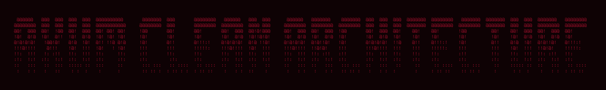

    

    
    
    
    
    

    A REST API built with Rust, Axum, Tokio, and SQLx following Clean Architecture principles.

    This project is a practical exercise focused on applying Clean Architecture principles and learning backend development with Rust.

---

## License

This project is licensed under the [MIT License](./LICENSE).

## Author

* [Yenterick](https://github.com/Yenterick)
